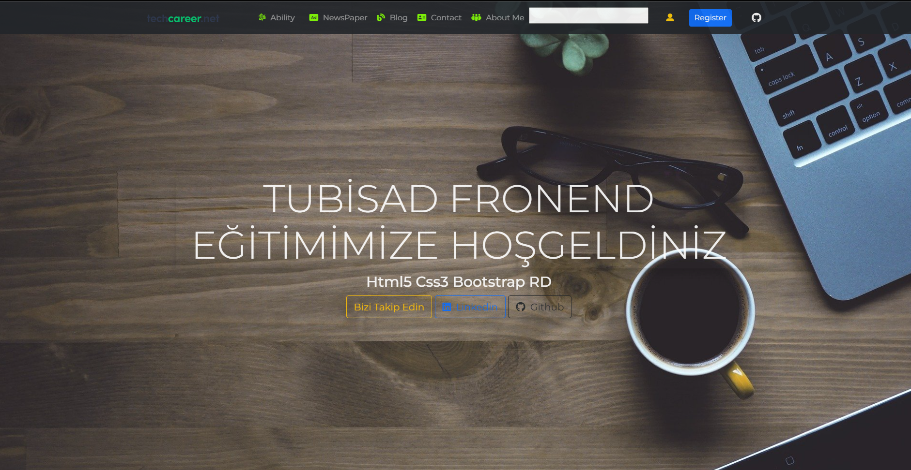

# TeachCareer Tubisad FrontEnd  Full Stack 2022
* [GitHub](https://github.com/hamitmizrak/TeachCareer_Tubisad)
* 
### Gereksinimler

intellij idea Ultimate 
Visual Studio Code
Node js
---

## Visual Studio codes
Extensisons
- Browser preview
- Auto Close tag
- Auto import
- Auto rename tag
- Bootstrap 5 Quick Snipperts
- Bracket Pair Colorizer 2
- Css Snippet
- Es7+ React/REdux/React-Native snippets
- Html Snippets
- JsQuery Snippets
- Live Server
- Material Icon Theme
- Open-in-Browser
- Path Intellisense
- Prettier Code formatter
- Project Manager
- Reactjs code Snippets

---

## Tecnology
##FrontEnd
- Html5
- Css3
- responsive design
- Js
- jquery
- Bootstrap
- react

---

## BackEnd
* javase
* jdbc crud native
* hibernate
* spring core
* spring mvc
* spring data
* spring rest
* spring security

---

## Libraries
Thymeleaf
Lombok
Validation

## Database
H2 Database
Mysql
Postgresql

---
## dependency
Spring Web
Spring Data JPA
Spring Rest
Spring Security

---
# Spring Tools
Spring Boot DevTools
Spring Configuration Processor
Spring Boot Actuator

---

## Docker Deployment

1.ADIM
npx create-react-app frontend
cd frontend
npm start
code .

2.ADIM
NOT: node_modules siliyoruz bunu sonrasında 
npm i

3.ADIM
terminal: package.json seviyesinde olacak şekilde
npm install axios
npm install bootstrap --save
npm install node-sass --save

